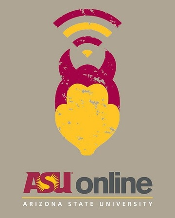

 

 
  

## contact us for more details

# Program Evaluation & Data Analytics

<a class="uk-button uk-button-default" href="https://asuonline.asu.edu/online-degree-programs/graduate/program-evaluation-and-data-analytics-ms/">APPLY TO THE ONLINE PROGRAM</a>

## Watts College of Public Service

<a class="uk-button uk-button-default" href="https://publicservice.asu.edu/programs/ms/program-evaluation-and-data-analytics-ms">INFO</a>

## Center for Technology, Data, and Society

]

 
